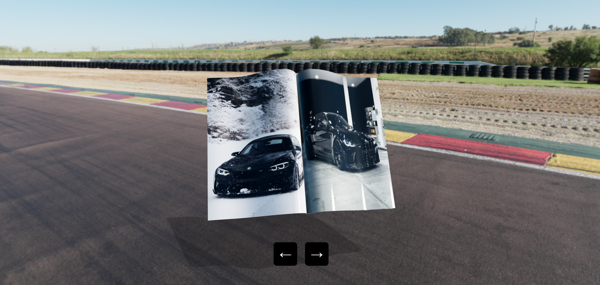

#  Animated 3D Sports Car Book using R3F


## How to use

1. Clone this repository

   ```bash
   git clone https://github.com/Hugosh71/R3F-SportsCar-Book.git
   ```
   
2. Install the dependencies

   ```python
   yarn
   ```

3. Launch 
   ```bash
   yarn dev
   ```
   
## Acknowledgment
This project is inspired of Wawa Sensei's work [R3F-animated-book-slider-final](https://github.com/wass08/r3f-animated-book-slider-final).

You can check all of his projects on his channel : [Youtube](https://www.youtube.com/@WawaSensei)
  
